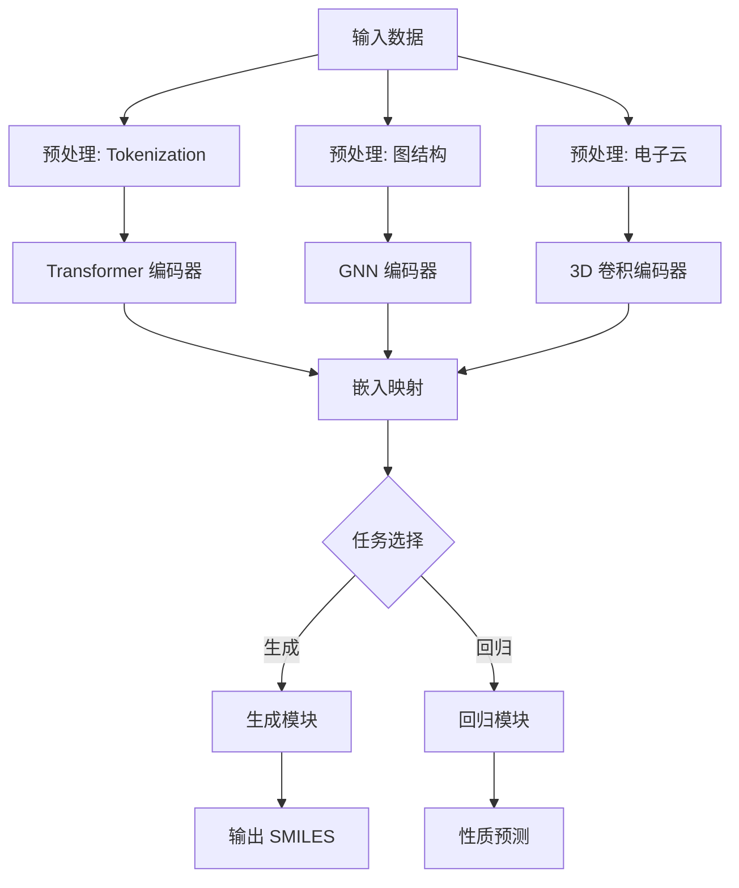

```mermaid
graph TD;
    A[输入数据] --> B[预处理: Tokenization];
    A --> C[预处理: 图结构];
    A --> D[预处理: 电子云];
    B --> E[Transformer 编码器];
    C --> F[GNN 编码器];
    D --> G[3D 卷积编码器];
    E --> H[嵌入映射];
    F --> H;
    G --> H;
    H --> I{任务选择};
    I --> |生成| J[生成模块];
    I --> |回归| K[回归模块];
    J --> L[输出 SMILES];
    K --> M[性质预测];
```